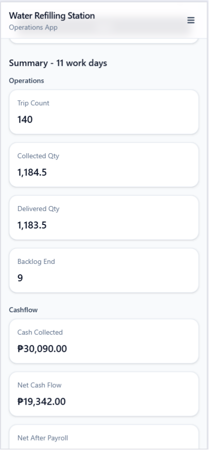
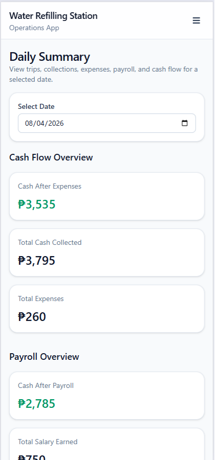
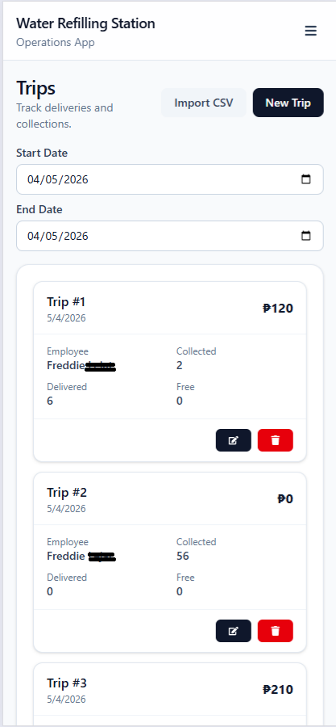
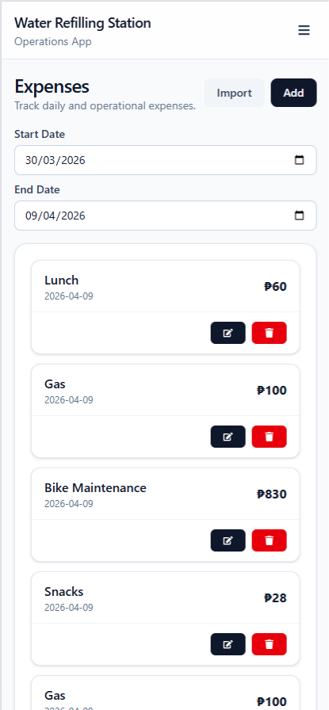
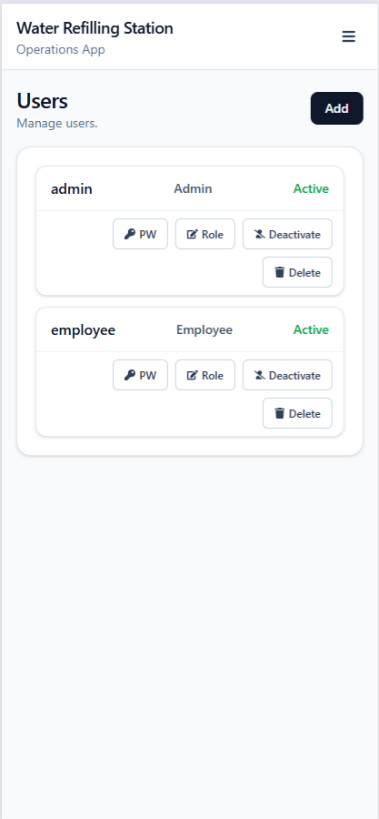

# Water Refilling Station App

A responsive Single Page Application (SPA) for managing the daily operations of a water refilling station. Built with React, TypeScript, and Vite, the application consumes the Water Refilling Station API to provide a fast and modern user experience across desktop and mobile devices.

## Overview

This project is the frontend of the Water Refilling Station Management System. It provides an intuitive interface for managing business operations while consuming a RESTful ASP.NET Core API. The application follows a feature-based architecture for improved scalability and maintainability.

## Screenshots

<p align="center">
  
  
  
</p>

<p align="center">
  
  
</p>

## Features

- Responsive dashboard
- Daily business summary
- Trip management
- Expense management
- Customer debt management
- Payroll management
- User and employee management
- Authentication and authorization
- Mobile and desktop responsive design

## Tech Stack

### Frontend
- React
- TypeScript
- Vite

### UI
- Tailwind CSS
- Responsive Design

### State & Data
- Axios
- REST API Integration

### Architecture
- Feature-Based Folder Structure
- Single Page Application (SPA)
- Component-Based Design

## Project Structure

```text
src
├── api
├── app
├── assets
├── components
├── features
├── hooks
├── types
└── utils
```

## Application Capabilities

- Single Page Application (SPA)
- Responsive layout for desktop and mobile
- REST API integration
- Protected routes
- JWT authentication
- Reusable components
- Modular feature-based architecture

## Getting Started

### Prerequisites

- Node.js 20+
- npm

### Installation

Clone the repository.

```bash
git clone https://github.com/Russell28/refilling-station-app.git
```

Navigate to the project.

```bash
cd refilling-station-app
```

Install dependencies.

```bash
npm install
```

Configure the API base URL in your environment file.

```env
VITE_API_URL=https://localhost:5001/api
```

Start the development server.

```bash
npm run dev
```

Build for production.

```bash
npm run build
```

## Backend API

This application consumes the Water Refilling Station API:

https://github.com/Russell28/refilling-station-api

## Future Improvements

- Offline support
- Progressive Web App (PWA)
- End-to-end testing

## License

This project is provided for portfolio and educational purposes.